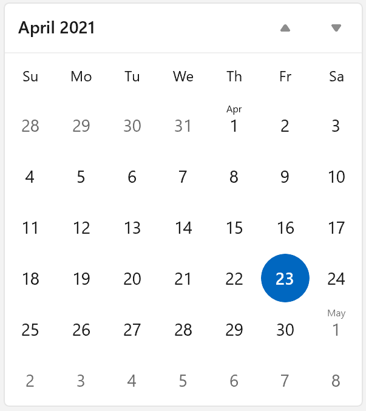
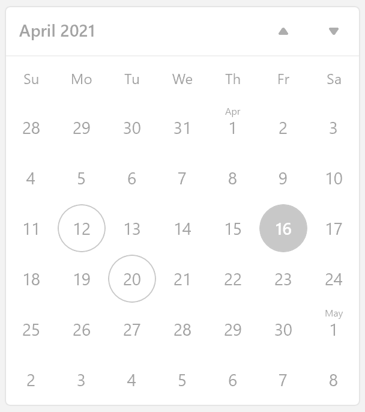
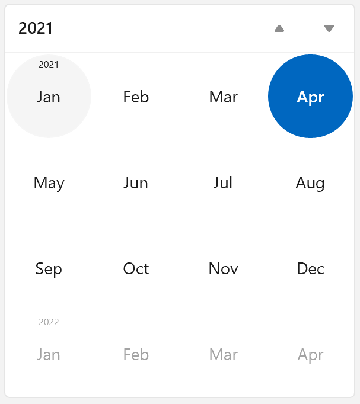
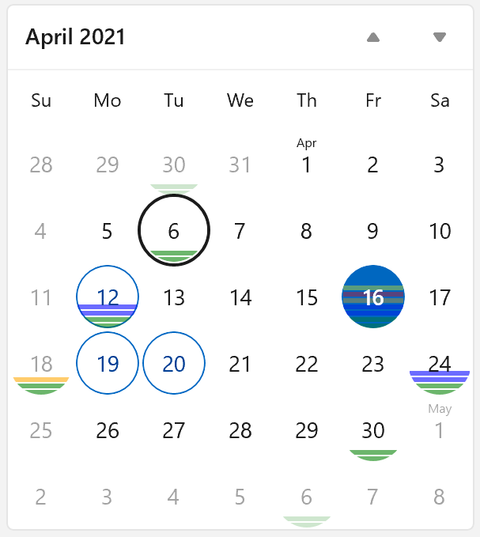
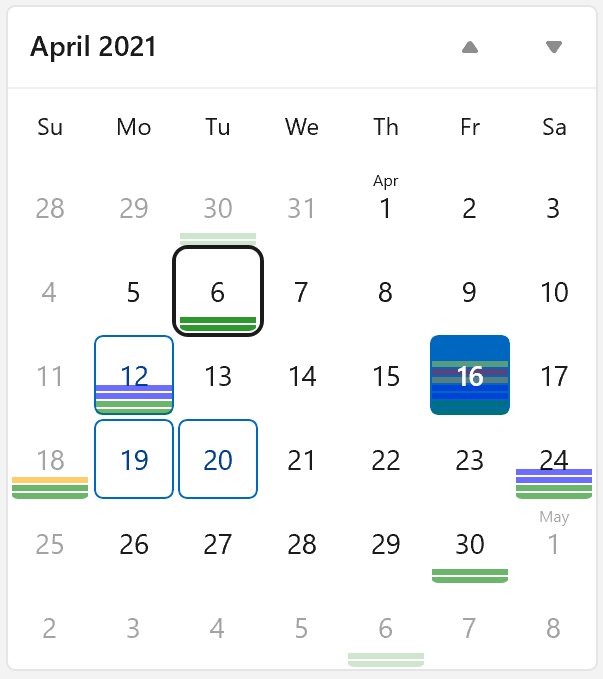

<!-- The purpose of this spec is to describe a new feature and
its APIs that make up a new feature in WinUI. -->

<!-- There are two audiences for the spec. The first are people
that want to evaluate and give feedback on the API, as part of
the submission process.  When it's complete
it will be incorporated into the public documentation at
docs.microsoft.com (http://docs.microsoft.com/uwp/toolkits/winui/).
Hopefully we'll be able to copy it mostly verbatim.
So the second audience is everyone that reads there to learn how
and why to use this API. -->

# Background
<!-- Use this section to provide background context for the new API(s) 
in this spec. -->

<!-- This section and the appendix are the only sections that likely
do not get copied to docs.microsoft.com; they're just an aid to reading this spec. -->

<!-- If you're modifying an existing API, included a link here to the
existing page(s) -->

<!-- For example, this section is a place to explain why you're adding this API rather than
modifying an existing API. -->

<!-- For example, this is a place to provide a brief explanation of some dependent
area, just explanation enough to understand this new API, rather than telling
the reader "go read 100 pages of background information posted at ...". -->
New styling properties are being added to the OS Xaml CalendarView control in order to enable more flexible rendering. Because a large part of the CalendarView rendering is achieved through custom OS code, 
the desired look cannot be achieved solely via XAML markup in the WinUI 2.6+ packages. New properties, used by those WinUI 2.6+ packages, are required to drive the custom OS rendering code.

# Description
<!-- Use this section to provide a brief description of the feature.
For an example, see the introduction to the PasswordBox control 
(http://docs.microsoft.com/windows/uwp/design/controls-and-patterns/password-box). -->
A new set of CalendarView styling properties are introduced to allow greater customization of the control's rendering in upcoming Windows OS releases.
These properties will be used in WinUI to align the CalendarView's styling with the rest of the standard controls.

# Examples
<!-- Use this section to explain the features of the API, showing
example code with each description. The general format is: 
  feature explanation,
  example code
  feature explanation,
  example code
  etc.-->
  
<!-- Code samples should be in C# and/or C++/WinRT -->

<!-- As an example of this section, see the Examples section for the PasswordBox control 
(https://docs.microsoft.com/windows/uwp/design/controls-and-patterns/password-box#examples). -->
## Today styling
The following properties of type Windows.UI.Xaml.Media.Brush are used to customize the current day's rendering when CalendarView.IsTodayHighlighted is True:
TodayBackground, TodayBlackoutBackground, TodayBlackoutForeground, TodayHoverBackground, TodayPressedBackground, TodaySelectedInnerBorderBrush.

### Showcasing the TodayBackground property in the month, year and decade views




### Showcasing the TodayHoverBackground property - current date is hovered


### Showcasing the TodayPressedBackground property - current date is pressed


### Showcasing the TodayBlackoutBackground and TodayBlackoutForeground properties - the old property CalendarView.IsTodayBlackedOut is True
Note: the blue background and white foreground colors are not final here.


### Showcasing the TodaySelectedInnerBorderBrush property - current date is selected


## Out Of Scope styling
The following properties of type Windows.UI.Xaml.Media.Brush are used to customize the calendar items that are outside the current scope (month, year, or decade):
OutOfScopeHoverForeground, OutOfScopePressedForeground.

### Showcasing the OutOfScopeHoverForeground property - 4th of May is hovered


### Showcasing the OutOfScopePressedForeground property - 4th of May is pressed


## Item background styling
The following properties of type Windows.UI.Xaml.Media.Brush are used to customize the background rendering of items in any DisplayMode:
CalendarItemHoverBackground, CalendarItemPressedBackground.

### Showcasing the CalendarItemHoverBackground property - February is hovered


### Showcasing the CalendarItemPressedBackground property - 2034 is pressed


## Disabled styling
The following properties of type Windows.UI.Xaml.Media.Brush are used to customize the rendering of a disabled CalendarView (when CalendarView.IsEnabled is False):
DisabledForeground, SelectedDisabledBorderBrush, CalendarItemDisabledBackground, TodayDisabledBackground, TodayDisabledForeground.

### Showcasing a disabled month view - the 12th and 20th of April are selected


## Day item positioning
The CalendarView's DayItemMargin, MonthYearMargin, FirstOfMonthLabelMargin, FirstOfYearDecadeLabelMargin properties of type Windows.UI.Xaml.Thickness 
allow positioning the day, month, year, first-of-month and first-of-year labels within a calendar item. 

### Showcasing the DayItemMargin and FirstOfMonthLabelMargin properties
Here the Month view has CalendarView.IsGroupLabelVisible set to True and the group and main labels do not overlap because CalendarView.DayItemMargin.Top is set to 6 pixels.
April 1st is selected and May 1st is hovered.


### Showcasing the MonthYearMargin and FirstOfYearDecadeLabelMargin properties
A Year view has CalendarView.IsGroupLabelVisible set to True with CalendarView.MonthYearItemMargin.Top and CalendarView.FirstOfYearDecadeLabelMargin.Top set to 2 and 3 pixels respectively.
January 2021 is hovered.



## Markup example

This shows a typical use of the new CalendarView properties set in markup. The HighContrast & Dark themes and control template have been removed for conciseness.

```
<ResourceDictionary 
    xmlns="http://schemas.microsoft.com/winfx/2006/xaml/presentation"
    xmlns:x="http://schemas.microsoft.com/winfx/2006/xaml">
    <ResourceDictionary.ThemeDictionaries>
        <ResourceDictionary x:Key="Default">
            <StaticResource x:Key="CalendarViewFocusVisualPrimaryBrush" ResourceKey="FocusStrokeColorOuterBrush" />
            <StaticResource x:Key="CalendarViewFocusVisualSecondaryBrush" ResourceKey="FocusStrokeColorInnerBrush" />
            <StaticResource x:Key="CalendarViewFocusBorderBrush" ResourceKey="AccentFillColorSecondaryBrush" />
            <StaticResource x:Key="CalendarViewSelectedHoverBorderBrush" ResourceKey="AccentFillColorSecondaryBrush" />
            <StaticResource x:Key="CalendarViewSelectedPressedBorderBrush" ResourceKey="SubtleFillColorTertiaryBrush" />
            <StaticResource x:Key="CalendarViewSelectedDisabledBorderBrush" ResourceKey="AccentFillColorDisabledBrush" />
            <StaticResource x:Key="CalendarViewSelectedBorderBrush" ResourceKey="AccentFillColorDefaultBrush" />
            <StaticResource x:Key="CalendarViewHoverBorderBrush" ResourceKey="SubtleFillColorSecondaryBrush" />
            <StaticResource x:Key="CalendarViewPressedBorderBrush" ResourceKey="SubtleFillColorTertiaryBrush" />
            <StaticResource x:Key="CalendarViewTodaySelectedInnerBorderBrush" ResourceKey="TextOnAccentFillColorPrimaryBrush" />
            <StaticResource x:Key="CalendarViewTodayForeground" ResourceKey="TextOnAccentFillColorPrimaryBrush" />
            <StaticResource x:Key="CalendarViewDisabledForeground" ResourceKey="TextFillColorDisabledBrush" />
            <StaticResource x:Key="CalendarViewBlackoutForeground" ResourceKey="TextFillColorDisabledBrush" />
            <StaticResource x:Key="CalendarViewSelectedForeground" ResourceKey="AccentTextFillColorPrimaryBrush" />
            <StaticResource x:Key="CalendarViewSelectedHoverForeground" ResourceKey="AccentTextFillColorPrimaryBrush" />
            <StaticResource x:Key="CalendarViewSelectedPressedForeground" ResourceKey="AccentTextFillColorTertiaryBrush" />
            <StaticResource x:Key="CalendarViewSelectedDisabledForeground" ResourceKey="AccentTextFillColorDisabledBrush" />
            <StaticResource x:Key="CalendarViewPressedForeground" ResourceKey="TextFillColorSecondaryBrush" />
            <StaticResource x:Key="CalendarViewOutOfScopeForeground" ResourceKey="TextFillColorDisabledBrush" />
            <StaticResource x:Key="CalendarViewOutOfScopeHoverForeground" ResourceKey="TextFillColorSecondaryBrush" />
            <StaticResource x:Key="CalendarViewOutOfScopePressedForeground" ResourceKey="TextFillColorTertiaryBrush" />
            <StaticResource x:Key="CalendarViewCalendarItemBackground" ResourceKey="SubtleFillColorTransparentBrush" />
            <StaticResource x:Key="CalendarViewCalendarItemBorderBrush" ResourceKey="SubtleFillColorTransparentBrush" />
            <StaticResource x:Key="CalendarViewCalendarItemForeground" ResourceKey="TextFillColorPrimaryBrush" />
            <StaticResource x:Key="CalendarViewTodayBackground" ResourceKey="AccentFillColorDefaultBrush" />
            <StaticResource x:Key="CalendarViewTodayBlackoutBackground" ResourceKey="AccentFillColorTertiaryBrush" />
            <StaticResource x:Key="CalendarViewTodayBlackoutForeground" ResourceKey="TextOnAccentFillColorPrimaryBrush" />
            <StaticResource x:Key="CalendarViewTodayHoverBackground" ResourceKey="AccentFillColorSecondaryBrush" />
            <StaticResource x:Key="CalendarViewTodayPressedBackground" ResourceKey="AccentFillColorTertiaryBrush" />
            <StaticResource x:Key="CalendarViewTodayDisabledBackground" ResourceKey="AccentFillColorDisabledBrush" />
            <StaticResource x:Key="CalendarViewOutOfScopeBackground" ResourceKey="SubtleFillColorTransparentBrush" />
            <StaticResource x:Key="CalendarViewForeground" ResourceKey="TextFillColorPrimaryBrush" />
            <StaticResource x:Key="CalendarViewBackground" ResourceKey="ControlFillColorInputActiveBrush" />
            <StaticResource x:Key="CalendarViewBorderBrush" ResourceKey="ControlStrokeColorDefaultBrush" />
            <StaticResource x:Key="CalendarViewWeekDayForegroundDisabled" ResourceKey="TextFillColorDisabledBrush" />
            <StaticResource x:Key="CalendarViewNavigationButtonBackground" ResourceKey="SubtleFillColorTransparentBrush" />
            <StaticResource x:Key="CalendarViewNavigationButtonBackgroundPointerOver" ResourceKey="SubtleFillColorSecondaryBrush" />
            <StaticResource x:Key="CalendarViewNavigationButtonBackgroundPressed" ResourceKey="SubtleFillColorTertiaryBrush" />
            <StaticResource x:Key="CalendarViewNavigationButtonForeground" ResourceKey="ControlStrongFillColorDefaultBrush" />
            <StaticResource x:Key="CalendarViewNavigationButtonForegroundPointerOver" ResourceKey="ControlStrongFillColorDefaultBrush" />
            <StaticResource x:Key="CalendarViewNavigationButtonForegroundPressed" ResourceKey="ControlStrongFillColorDefaultBrush" />
            <StaticResource x:Key="CalendarViewNavigationButtonForegroundDisabled" ResourceKey="ControlStrongFillColorDisabledBrush" />
            <StaticResource x:Key="CalendarViewHeaderNavigationButtonForegroundPointerOver" ResourceKey="TextFillColorPrimaryBrush" />
            <StaticResource x:Key="CalendarViewHeaderNavigationButtonForegroundPressed" ResourceKey="TextFillColorSecondaryBrush" />
            <StaticResource x:Key="CalendarViewHeaderNavigationButtonForegroundDisabled" ResourceKey="TextFillColorDisabledBrush" />
            <StaticResource x:Key="CalendarViewNavigationButtonBorderBrushPointerOver" ResourceKey="SubtleFillColorTransparentBrush" />
            <StaticResource x:Key="CalendarViewNavigationButtonBorderBrush" ResourceKey="SubtleFillColorTransparentBrush" />
        </ResourceDictionary>
        <ResourceDictionary x:Key="HighContrast">
            ...
        </ResourceDictionary>
        <ResourceDictionary x:Key="Light">
            ...
        </ResourceDictionary>
    </ResourceDictionary.ThemeDictionaries>

    <x:Boolean x:Key="CalendarViewBaseItemRoundedChromeEnabled">True</x:Boolean>
    <Thickness x:Key="CalendarViewDayItemMargin">0,6,0,0</Thickness>
    <Thickness x:Key="CalendarViewMonthYearItemMargin">0,2,0,0</Thickness>
    <Thickness x:Key="CalendarViewFirstOfMonthLabelMargin">0,1,0,0</Thickness>
    <Thickness x:Key="CalendarViewFirstOfYearDecadeLabelMargin">0,3,0,0</Thickness>

    <Style x:Key="CalendarViewDefaultStyle" TargetType="CalendarView">
        <Setter Property="SelectedHoverBorderBrush" Value="{ThemeResource CalendarViewSelectedHoverBorderBrush}" />
        <Setter Property="SelectedPressedBorderBrush" Value="{ThemeResource CalendarViewSelectedPressedBorderBrush}" />
        <Setter Property="SelectedDisabledBorderBrush" Value="{ThemeResource CalendarViewSelectedDisabledBorderBrush}" /> *
        <Setter Property="SelectedBorderBrush" Value="{ThemeResource CalendarViewSelectedBorderBrush}" />
        <Setter Property="HoverBorderBrush" Value="{ThemeResource CalendarViewHoverBorderBrush}" />
        <Setter Property="PressedBorderBrush" Value="{ThemeResource CalendarViewPressedBorderBrush}" />
        <Setter Property="CalendarItemBorderBrush" Value="{ThemeResource  CalendarViewCalendarItemBorderBrush}" />
        <Setter Property="TodaySelectedInnerBorderBrush" Value="{ThemeResource  CalendarViewTodaySelectedInnerBorderBrush}" /> *
        <Setter Property="TodayForeground" Value="{ThemeResource CalendarViewTodayForeground}" />
        <Setter Property="TodayDisabledForeground" Value="{ThemeResource CalendarViewTodayDisabledForeground}" /> *
        <Setter Property="DisabledForeground" Value="{ThemeResource CalendarViewDisabledForeground}" /> *
        <Setter Property="BlackoutForeground" Value="{ThemeResource CalendarViewBlackoutForeground}" />
        <Setter Property="SelectedForeground" Value="{ThemeResource CalendarViewSelectedForeground}" />
        <Setter Property="PressedForeground" Value="{ThemeResource CalendarViewPressedForeground}" />
        <Setter Property="OutOfScopeForeground" Value="{ThemeResource CalendarViewOutOfScopeForeground}" />
        <Setter Property="OutOfScopeHoverForeground" Value="{ThemeResource CalendarViewOutOfScopeHoverForeground}" /> *
        <Setter Property="OutOfScopePressedForeground" Value="{ThemeResource CalendarViewOutOfScopePressedForeground}" /> *
        <Setter Property="CalendarItemForeground" Value="{ThemeResource CalendarViewCalendarItemForeground}" />
        <Setter Property="TodayBackground" Value="{ThemeResource CalendarViewTodayBackground}" /> *
        <Setter Property="TodayBlackoutBackground" Value="{ThemeResource CalendarViewTodayBlackoutBackground}" /> *
        <Setter Property="TodayBlackoutForeground" Value="{ThemeResource CalendarViewTodayBlackoutForeground}" /> *
        <Setter Property="TodayHoverBackground" Value="{ThemeResource CalendarViewTodayHoverBackground}" /> *
        <Setter Property="TodayPressedBackground" Value="{ThemeResource CalendarViewTodayPressedBackground}" /> *
        <Setter Property="TodayDisabledBackground" Value="{ThemeResource CalendarViewTodayDisabledBackground}" /> *
        <Setter Property="OutOfScopeBackground" Value="{ThemeResource CalendarViewOutOfScopeBackground}" />
        <Setter Property="CalendarItemBackground" Value="{ThemeResource CalendarViewCalendarItemBackground}" />
        <Setter Property="CalendarItemHoverBackground" Value="{ThemeResource CalendarViewCalendarItemHoverBackground}" /> *
        <Setter Property="CalendarItemPressedBackground" Value="{ThemeResource CalendarViewCalendarItemPressedBackground}" /> *
        <Setter Property="CalendarItemDisabledBackground" Value="{ThemeResource CalendarViewCalendarItemDisabledBackground}" /> *
        <Setter Property="Foreground" Value="{ThemeResource CalendarViewForeground}" />
        <Setter Property="Background" Value="{ThemeResource CalendarViewBackground}" />
        <Setter Property="BorderBrush" Value="{ThemeResource CalendarViewBorderBrush}" />
        <Setter Property="DayItemFontFamily" Value="XamlAutoFontFamily" />
        <Setter Property="DayItemFontSize" Value="{ThemeResource CalendarViewDayItemFontSize}" />
        <Setter Property="DayItemMargin" Value="{ThemeResource CalendarViewDayItemMargin}" /> *
        <Setter Property="FirstOfMonthLabelFontFamily" Value="XamlAutoFontFamily" />
        <Setter Property="FirstOfMonthLabelFontSize" Value="{ThemeResource CalendarViewFirstOfMonthLabelFontSize}" />
        <Setter Property="FirstOfMonthLabelMargin" Value="{ThemeResource CalendarViewFirstOfMonthLabelMargin}" /> *
        <Setter Property="MonthYearItemFontFamily" Value="XamlAutoFontFamily" />
        <Setter Property="MonthYearItemFontSize" Value="{ThemeResource CalendarViewMonthYearItemFontSize}" />
        <Setter Property="MonthYearItemMargin" Value="{ThemeResource CalendarViewMonthYearItemMargin}" /> *
        <Setter Property="FirstOfYearDecadeLabelFontFamily" Value="XamlAutoFontFamily" />
        <Setter Property="FirstOfYearDecadeLabelFontSize" Value="{ThemeResource CalendarViewFirstOfYearDecadeLabelFontSize}" />
        <Setter Property="FirstOfYearDecadeLabelMargin" Value="{ThemeResource CalendarViewFirstOfYearDecadeLabelMargin}" /> *
        <Setter Property="CalendarItemBorderThickness" Value="1" />
        <Setter Property="BorderThickness" Value="1" />
        <Setter Property="HorizontalAlignment" Value="Left" />
        <Setter Property="VerticalAlignment" Value="Center" />
        <Setter Property="HorizontalContentAlignment" Value="Stretch" />
        <Setter Property="VerticalContentAlignment" Value="Stretch" />
        <Setter Property="IsTabStop" Value="False" />
        <Setter Property="UseSystemFocusVisuals" Value="{StaticResource UseSystemFocusVisuals}" />
        <Setter Property="CornerRadius" Value="{ThemeResource ControlCornerRadius}" />
        <Setter Property="Template">
          ...
        </Setter>
    </Style>
</ResourceDictionary>
```

The new properties appear with a * on their right.


# Remarks
<!-- Explanation and guidance that doesn't fit into the Examples section. -->

<!-- APIs should only throw exceptions in exceptional conditions; basically,
only when there's a bug in the caller, such as argument exception.  But if for some
reason it's necessary for a caller to catch an exception from an API, call that
out with an explanation either here or in the Examples -->

The Windows OS code switches to the new rendering, capable of showing calendar items with rounded corners, when there is a boolean theme resource named CalendarViewBaseItemRoundedChromeEnabled set to True.
WinUI will set that resource to True for applications that use 'Version2' for ControlsResourcesVersion (<controls:XamlControlsResources ControlsResourcesVersion="Version2"/>).
```
    <x:Boolean x:Key="CalendarViewBaseItemRoundedChromeEnabled">True</x:Boolean>
```

# API Notes
<!-- Option 1: Give a one or two line description of each API (type
and member), or at least the ones that aren't obvious
from their name.  These descriptions are what show up
in IntelliSense. For properties, specify the default value of the property if it
isn't the type's default (for example an int-typed property that doesn't default to zero.) -->

<!-- Option 2: Put these descriptions in the below API Details section,
with a "///" comment above the member or type. -->
These properties are added to the CalendarView control:

`public Windows.UI.Xaml.Thickness DayItemMargin { get; set; }`

Gets or sets the margin applied to the main label inside a calendar day item.

`public Windows.UI.Xaml.Thickness MonthYearItemMargin { get; set; }`

Gets or sets the margin applied to the main label inside a calendar month or year item.

`public Windows.UI.Xaml.Thickness FirstOfMonthLabelMargin { get; set; }`

Gets or sets the margin used to display the first-of-month banner in the calendar.

`public Windows.UI.Xaml.Thickness FirstOfYearDecadeLabelMargin { get; set; }`

Gets or sets the margin used to display the first-of-year banner in the calendar.

`public Windows.UI.Xaml.CornerRadius CalendarItemCornerRadius { get; set; }`

Gets or sets the corner radius for a calendar item's visuals.

The visuals affected are the background of the current date, the border around selected items, the density bars as well as the focus cue.

When this property is left unset, the CalendarView automatically uses a corner radius that is half the item size so that the various visuals appear circular.

In this example, because the items size is 40x40px, the automatic corner radius is 20px:



When set, the CalendarView instead adopts the property value for the various visuals.

In this example, the CalendarItemCornerRadius property is set to 4px:



`public Windows.UI.Xaml.Media.Brush DisabledForeground { get; set; }`

Gets or sets a brush that provides the foreground of a calendar item while it's disabled.

`public Windows.UI.Xaml.Media.Brush SelectedDisabledBorderBrush { get; set; }`

Gets or sets a brush that provides the border of a selected calendar item while it's disabled.

`public Windows.UI.Xaml.Media.Brush CalendarItemHoverBackground { get; set; }`

Gets or sets a brush that provides the background of a calendar item while the pointer is over it.

`public Windows.UI.Xaml.Media.Brush CalendarItemPressedBackground { get; set; }`

Gets or sets a brush that provides the background of a calendar item while it's pressed.

`public Windows.UI.Xaml.Media.Brush CalendarItemDisabledBackground { get; set; }`

Gets or sets a brush that provides the background of a calendar item while it's disabled.

`public Windows.UI.Xaml.Media.Brush OutOfScopeHoverForeground { get; set; }`

Gets or sets a brush that provides the foreground of calendar items that are outside the current scope (month, year, or decade) while the pointer is over them.

`public Windows.UI.Xaml.Media.Brush OutOfScopePressedForeground { get; set; }`

Gets or sets a brush that provides the foreground of calendar items that are outside the current scope (month, year, or decade) while they are pressed.

`public Windows.UI.Xaml.Media.Brush TodayBackground { get; set; }`

Gets or sets a brush that provides the background of the calendar item for the current date.

`public Windows.UI.Xaml.Media.Brush TodayBlackoutBackground { get; set; }`

Gets or sets a brush that provides the background of the calendar item for the current date while it's blacked out.

`public Windows.UI.Xaml.Media.Brush TodayBlackoutForeground { get; set; }`

Gets or sets a brush that provides the foreground of the calendar item for the current date while it's blacked out.

`public Windows.UI.Xaml.Media.Brush TodayHoverBackground { get; set; }`

Gets or sets a brush that provides the background of the calendar item for the current date while the pointer is over it.

`public Windows.UI.Xaml.Media.Brush TodayPressedBackground { get; set; }`

Gets or sets a brush that provides the background of the calendar item for the current date while it's pressed.

`public Windows.UI.Xaml.Media.Brush TodayDisabledBackground { get; set; }`

Gets or sets a brush that provides the background of the calendar item for the current date while it's disabled.

`public Windows.UI.Xaml.Media.Brush TodayDisabledForeground { get; set; }`

Gets or sets a brush that provides the foreground of the calendar item for the current date while it's disabled.

`public Windows.UI.Xaml.Media.Brush TodaySelectedInnerBorderBrush { get; set; }`

Gets or sets a brush that provides the border of the calendar item for the current date while it's selected.


# API Details
<!-- The exact API, in MIDL3 format (https://docs.microsoft.com/en-us/uwp/midl-3/) -->
    [contract(Windows.Foundation.UniversalApiContract, 1)]
    [webhosthidden]
    [static_name("Windows.UI.Xaml.Controls.ICalendarViewStatics", 7260f1c4-2f5d-41bd-99bb-4571b20b79a8)]
    [constructor_name("Windows.UI.Xaml.Controls.ICalendarViewFactory", 3d8f82e3-6cc6-423e-8d7c-7014d954ddef)]
    [interface_name("Windows.UI.Xaml.Controls.ICalendarView", cd639203-dfb5-4312-ac07-c0391824607b)]
    unsealed runtimeclass CalendarView
        : Windows.UI.Xaml.Controls.Control
    {
        // Existing CalendarView APIs not shown here.

        [contract(Windows.Foundation.UniversalApiContract, 13)]
        {
            Windows.UI.Xaml.Thickness DayItemMargin;
            Windows.UI.Xaml.Thickness MonthYearItemMargin;
            Windows.UI.Xaml.Thickness FirstOfMonthLabelMargin;
            Windows.UI.Xaml.Thickness FirstOfYearDecadeLabelMargin;

            Windows.UI.Xaml.CornerRadius CalendarItemCornerRadius;

            Windows.UI.Xaml.Media.Brush DisabledForeground;
            Windows.UI.Xaml.Media.Brush SelectedDisabledBorderBrush;
            Windows.UI.Xaml.Media.Brush CalendarItemHoverBackground;
            Windows.UI.Xaml.Media.Brush CalendarItemPressedBackground;
            Windows.UI.Xaml.Media.Brush CalendarItemDisabledBackground;
            Windows.UI.Xaml.Media.Brush OutOfScopeHoverForeground;
            Windows.UI.Xaml.Media.Brush OutOfScopePressedForeground;
            Windows.UI.Xaml.Media.Brush TodayBackground;
            Windows.UI.Xaml.Media.Brush TodayBlackoutBackground;
            Windows.UI.Xaml.Media.Brush TodayBlackoutForeground;
            Windows.UI.Xaml.Media.Brush TodayHoverBackground;
            Windows.UI.Xaml.Media.Brush TodayPressedBackground;
            Windows.UI.Xaml.Media.Brush TodayDisabledBackground;
            Windows.UI.Xaml.Media.Brush TodayDisabledForeground
            Windows.UI.Xaml.Media.Brush TodaySelectedInnerBorderBrush;

            static Windows.UI.Xaml.DependencyProperty DayItemMarginProperty{ get; };
            static Windows.UI.Xaml.DependencyProperty MonthYearItemMarginProperty{ get; };
            static Windows.UI.Xaml.DependencyProperty FirstOfMonthLabelMargin{ get; };
            static Windows.UI.Xaml.DependencyProperty FirstOfYearDecadeLabelMargin{ get; };

            static Windows.UI.Xaml.DependencyProperty CalendarItemCornerRadiusProperty{ get; };

            static Windows.UI.Xaml.DependencyProperty DisabledForegroundProperty{ get; };
            static Windows.UI.Xaml.DependencyProperty SelectedDisabledBorderBrushProperty{ get; };
            static Windows.UI.Xaml.DependencyProperty CalendarItemHoverBackgroundProperty{ get; };
            static Windows.UI.Xaml.DependencyProperty CalendarItemPressedBackgroundProperty{ get; };
            static Windows.UI.Xaml.DependencyProperty CalendarItemDisabledBackgroundProperty{ get; };
            static Windows.UI.Xaml.DependencyProperty OutOfScopeHoverForegroundProperty{ get; };
            static Windows.UI.Xaml.DependencyProperty OutOfScopePressedForegroundProperty{ get; };
            static Windows.UI.Xaml.DependencyProperty TodayBackgroundProperty{ get; };
            static Windows.UI.Xaml.DependencyProperty TodayBlackoutBackgroundProperty{ get; };
            static Windows.UI.Xaml.DependencyProperty TodayBlackoutForegroundProperty{ get; };
            static Windows.UI.Xaml.DependencyProperty TodayHoverBackgroundProperty{ get; };
            static Windows.UI.Xaml.DependencyProperty TodayPressedBackgroundProperty{ get; };
            static Windows.UI.Xaml.DependencyProperty TodayDisabledBackgroundProperty{ get; };
            static Windows.UI.Xaml.DependencyProperty TodayDisabledForegroundProperty{ get; };
            static Windows.UI.Xaml.DependencyProperty TodaySelectedInnerBorderBrushProperty{ get; };
        }
    };

# Appendix
<!-- Anything else that you want to write down for posterity, but 
that isn't necessary to understand the purpose and usage of the API.
For example, implementation details. -->
## New CalendarViewBaseItemRoundedChromeEnabled resource

The new CalendarViewBaseItemRoundedChromeEnabled boolean resource is similar to other ones introduced recently:
```
    <x:Boolean x:Key="CalendarViewBaseItemRoundedChromeEnabled">False</x:Boolean>

    <x:Boolean x:Key="HyperlinkUnderlineVisible">True</x:Boolean>
    <x:Boolean x:Key="ListViewBaseItemRoundedChromeEnabled">False</x:Boolean>
    <x:Boolean x:Key="ThemeShadowIsUsingDropShadows">False</x:Boolean>
```

## Fitting the new property names among the old ones
The new properties were named to fit well with the CalendarView existing properties:

New property name | Similar old property names
------ | ------
DayItemMargin | DayItemFontFamily, DayItemFontSize, DayItemFontStyle
MonthYearItemMargin | MonthYearItemFontFamily, MonthYearItemFontSize, MonthYearItemFontStyle
FirstOfMonthLabelMargin | FirstOfMonthLabelFontFamily, FirstOfMonthLabelFontSize, FirstOfMonthLabelFontStyle
FirstOfYearDecadeLabelMargin | FirstOfYearDecadeLabelFontFamily, FirstOfYearDecadeLabelFontSize, FirstOfYearDecadeLabelFontStyle
CalendarItemCornerRadius | CalendarItemBorderThickness, CalendarItemBorderBrush, CalendarItemForeground
DisabledForeground | PressedForeground, SelectedForeground, BlackoutForeground
SelectedDisabledBorderBrush | SelectedHoverBorderBrush, SelectedPressedBorderBrush
CalendarItemHoverBackground | CalendarItemBackground, CalendarItemForeground
CalendarItemPressedBackground | CalendarItemBackground, CalendarItemForeground
CalendarItemDisabledBackground | CalendarItemBackground, CalendarItemForeground
OutOfScopeHoverForeground | OutOfScopeForeground, OutOfScopeBackground
OutOfScopePressedForeground | OutOfScopeForeground, OutOfScopeBackground
TodayBackground | TodayForeground, OutOfScopeBackground
TodayBlackoutBackground | TodayForeground, OutOfScopeBackground
TodayBlackoutForeground | TodayForeground, OutOfScopeForeground
TodayHoverBackground | TodayHoverBorderBrush, TodayForeground
TodayPressedBackground | OutOfScopeBackground, TodayForeground
TodayDisabledBackground | OutOfScopeBackground, TodayForeground
TodayDisabledForeground | TodayForeground, OutOfScopeForeground
TodaySelectedInnerBorderBrush | TodayHoverBorderBrush, TodayPressedBorderBrush
